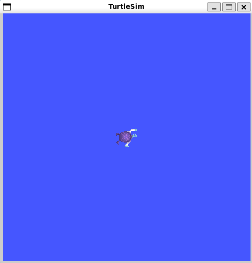
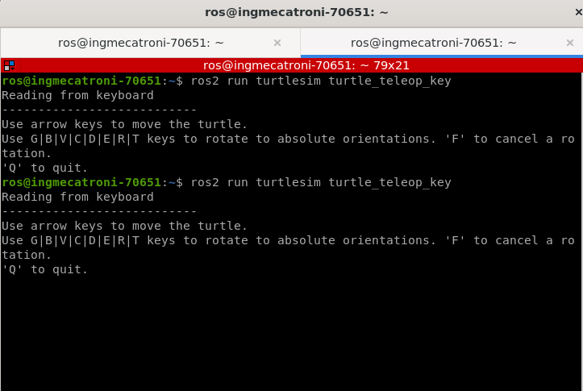
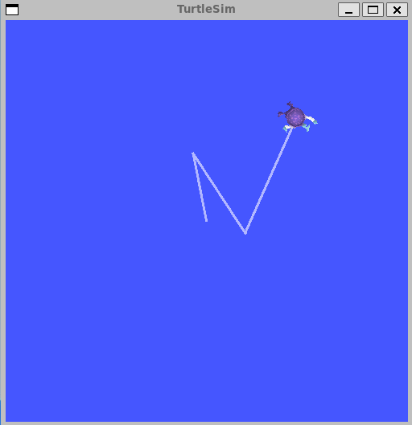
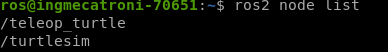
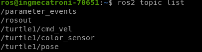
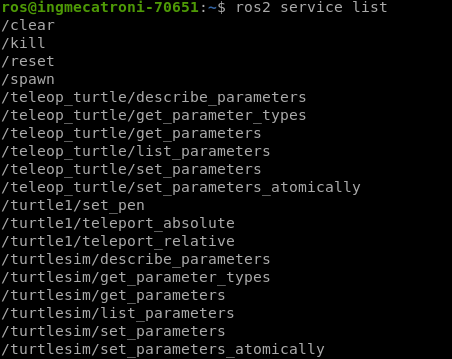
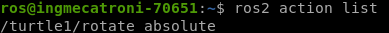
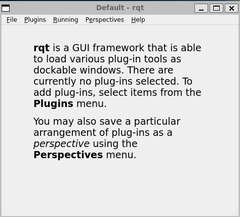

# Clase Turtle Sim


El objetivo de la presente práctica es conocer los conceptos básico de ROS2 Humble (paquete, nodo, topicos, info y rqt), para la simulación del comportamiento de un robot móvil

### Instalación de paquete Turtlesim


<p align="center">
  <a href="https://youtu.be/sk0WTxr-yic?si=M51wHld4yW2u4Ymt">
    
  </a>
</p>

<p align="center">
<a href="https://youtu.be/sk0WTxr-yic?si=M51wHld4yW2u4Ymt" target="_blank">**Enlace a Video de instalación - Haga clic aquí para más información**</a>.
</p>

Abre una terminal y sigue los siguientes pasos.

Presione 
```bash
Crtl + alt + t

```
```bash
sudo apt install ros-humble-turtlesim
```
Revisar si los paquetes están instalados:
```bash
ros2 pkg executables turtlesim
```
En la terminal debe aparecer los siguientes paquetes:

<p align="center">

</p>

## Nodo
Los nodos son las unidades básicas de ejecución en ROS y cada uno se encarga de una tarea específica, como controlar un sensor, realizar cálculos, procesar datos, o controlar actuadores.
  
Ejecutar el simulador Turtlesim en la terminal:
```bash
ros2 run turtlesim turtlesim_node
```
Ejecutar el paquete de Teleoperación en una nueva terminal:
```bash
Presione CRTL + SHIFT + t
```

```bash
ros2 run turtlesim turtle_teleop_key
```
Debe aparaecer un ventana como se muestra a continuación:
<p align="center">

</p>

Emplee las teclas de flechas para desplazar  y las letras (G,B,V,C,D,E,R,T), para orientar la tortuga sobre la terminal de teleoperación.
<p align="center">

</p>

<p align="center">

</p>

Revisar nodos activos en ros es...
```bash
ros2 node list
```
<p align="center">

</p>

## TOPIC
Los topics en ROS proporcionan una manera eficiente y flexible de intercambiar datos entre nodos, lo que facilita la construcción de sistemas robóticos complejos mediante la composición de nodos con funciones específicas.
Revisar tópicos activos
```bash
ros2 topic list
```
<p align="center">

</p>

## Service

Un servicio en ROS (Robot Operating System) es una forma de comunicación entre nodos que se basa en el modelo de petición-respuesta. A diferencia de los topics, que están diseñados para un flujo de datos unidireccional y continuo bajo el paradigma de publicación-suscripción, los servicios permiten una interacción bidireccional y síncrona entre dos nodos. Un nodo ofrece un servicio bajo un nombre específico, mientras que otro nodo puede llamar a este servicio, enviando un mensaje de petición y esperando recibir un mensaje de respuesta.


- `Comunicación síncrona`
- `Bidireccional`
- `Operaciones definidas`

Revisar servicios activos en ROS:
```bash
ros2 service list
```
<p align="center">

</p>

## Action

es un medio de comunicación entre nodos diseñado para ejecutar tareas que toman un tiempo considerable y para las cuales es deseable obtener retroalimentación sobre el progreso de la tarea. A diferencia de los servicios en ROS, que son adecuados para solicitudes síncronas de petición-respuesta que se esperan completar rápidamente, las acciones permiten una interacción más compleja y de larga duración entre nodos.

- `Comunicación Asíncrona`
- `Retroalimentación durante la Ejecución`
- `Cancelación de Tareas`


Revisar acciones activas en ROS:
```bash
ros2 action list
```
<p align="center">

</p>

Ejecutar rqt y abrir plugins (Dynamic Reconfigure, topic monitor, Matplot):
En el servicio de service caller, anexe una nueva tortuga "turtle2" en las cordenadas x,y (1,1)

```bash
rqt
```
<p align="center">

</p>


```bash
rqt_graph
```
```bash
ros2 run turtlesim turtle_teleop_key --ros-args --remap turtle1/cmd_vel:=Luisa/cmd_vel
```
```bash
ros2 topic info /Luisa/cmd_vel
```
```bash
ros2 topic echo /Luisa/cmd_vel
```
```bash
rqt 
```
```bash
ros2 topic list -t
```
```bash
ros2 interface show geometry_msgs/msg/Twist
```
```bash
ros2 topic pub --rate 1 /Luisa/cmd_vel geometry_msgs/msg/Twist "{linear: {x: 2.0, y: 0.0, z: 0.0}, angular: {x: 0.0,  y: 0.0, z: 1.8}}"
```
```bash
ros2 topic type /Luisa/pose
```
```bash
ros2 interface proto turtlesim/msg/Pose
```
