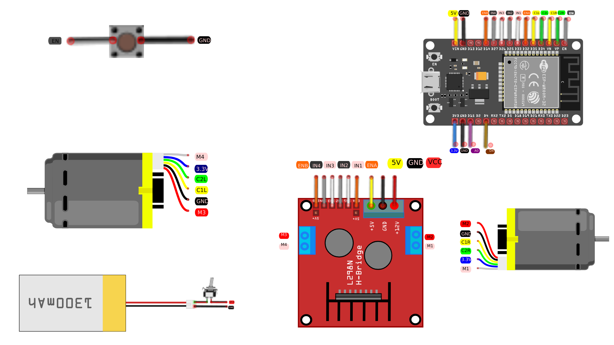
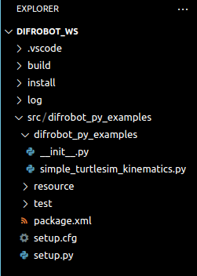
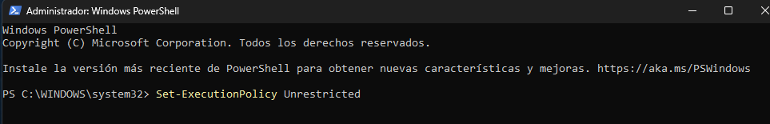
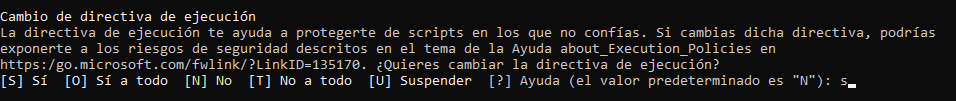

# Clase Implementación de Real Robot


El objetivo de la presente práctica es implementar un robot tipo diferencial, empleando una ley de control PID y seguimiento de trayectoria
## Diagrama de conección Esp-32:
Realizar las conexiones que se indican en la figura.

<p align="center">

</p>

# Creación de entorno virtual

## instalación de virtualenv:
En una terminal de VsCode escribir los comandos:

```bash
pip install virtualenv
```


## Habilitar permisos de entornos

Ejecutar Windows PowerShell


En la terminal escribir el comando 


```bash
Set-ExecutionPolicy Unrestricted
```
Escribir s y presionar enter



## Crear el entorno virtual:
Navega hasta el directorio raíz de tu proyecto y ejecuta el siguiente comando para crear un nuevo entorno virtual. Puedes reemplazar nombre_del_entorno con el nombre que desees para tu entorno virtual

Python 3.11 o superior

```bash
python -m venv venv
```


Python 3.10 o menor
```bash
virtualenv venv
```

## Activar el entorno

En Windows:
```bash
.\venv\Scripts\activate
```


## Instalar requerimientos
```bash
pip install -r requirements.txt

```

## Desactivar el entorno virtual
```bash
deactivate
```
