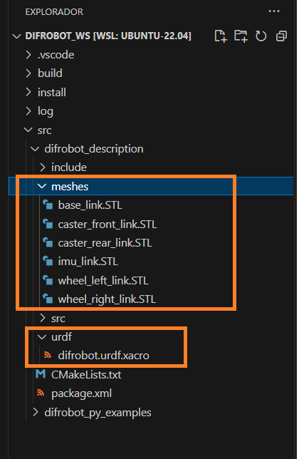
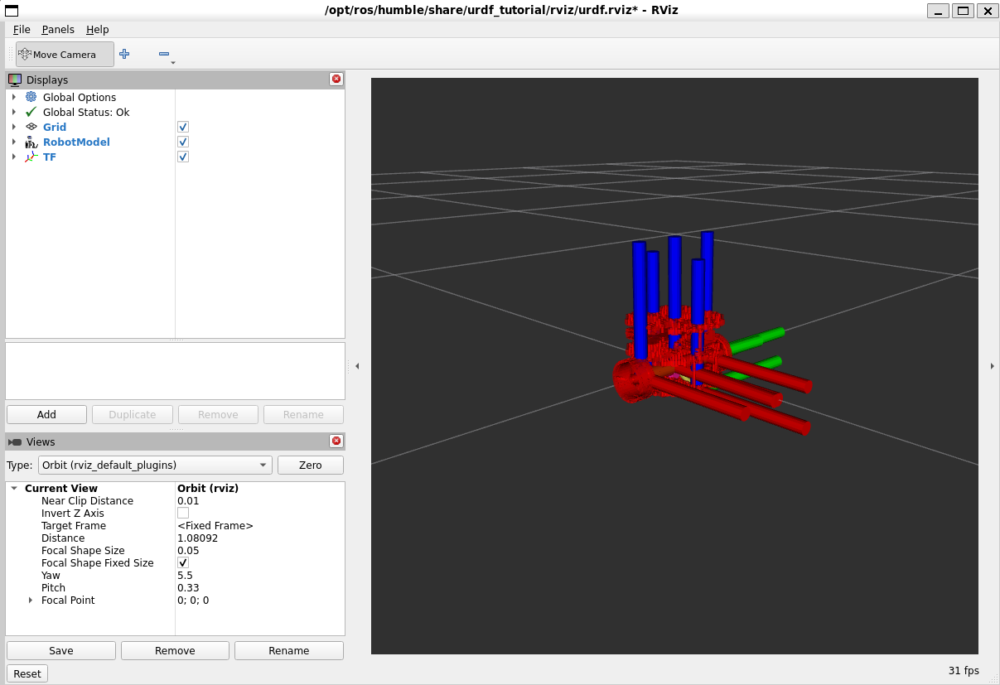

# Clase Robot URDF


El objetivo de la presente práctica es conocer los conceptos básico de ROS2 Humble (paquete, nodo, topicos, info y rqt), para la simulación del comportamiento de un robot móvil

### Instalación de paquete Turtlesim


<p align="center">
  <a href="https://youtu.be/sk0WTxr-yic?si=M51wHld4yW2u4Ymt">
    
  </a>
</p>

<p align="center">
<a href="https://youtu.be/sk0WTxr-yic?si=M51wHld4yW2u4Ymt" target="_blank">**Enlace a Video de instalación - Haga clic aquí para más información**</a>.
</p>

Abre una terminal y sigue los siguientes pasos.

Presione 
```bash
Crtl + alt + t

```
Crear un directorio llamado difrobot_ws y un sub directorio src
```bash
mkdir -p difrobot_ws/src
```
Abrir carpeta difrobot_ws:
```bash
cd difrobot_ws/
```
Compilar proyecto
```bash
colcon build
```

revisar si se crearon las carpetas build, install log y src
```bash
ls
```
Cambiar a directorio src
```bash
cd src/
```

Crear paquete difrobot_py_examples
```bash
ros2 pkg create --build-type ament_python difrobot_py_examples
```
Compilar proyecto
```bash
cd ..
```
```bash
colcon build
```

Crear paquete difrobot_description
```bash
cd src/
```
```bash
ros2 pkg create --build-type ament_cmake difrobot_description
```
Compilar proyecto
```bash
cd ..
```
```bash
colcon build
```


En la terminal buscar la ruta difrobot_wsy ejecutar VsCode:
```bash
cd difrobot_ws
```
```bash
code .
```
En Vscode seleccionar la ruta difrobot_ws/src/difrobot_description/ crear las carpetas y el archivo mostrado en  la imagen:
<p align="center">

</p>


Compilar el paquete difrobot_description en la ruta difrobot_ws
```bash
cd difrobot_ws
```
```bash
colcon build
```
En una nueva terminal actualizar el bash:
```bash
. install/setup.bash
```
instalar en el proyecto el paquete urdf-tutorial
```bash
sudo apt-get install ros-humble-urdf-tutorial
```
Ejecutar RVIZ con el modelo difrobot.urdf.xacro:
```bash
ros2 launch urdf_tutorial display.launch.py model:=/home/ros/difrobot_ws/src/difrobot_description/urdf/difrobot.urdf.xacro
```

<p align="center">

</p>


## Restablecer ventana RQT
Como volver a la configuración de ventanas en rqt en ros2 humble
```bash
rm -rf ~/.config/ros.org/rqt_gui.ini

```
