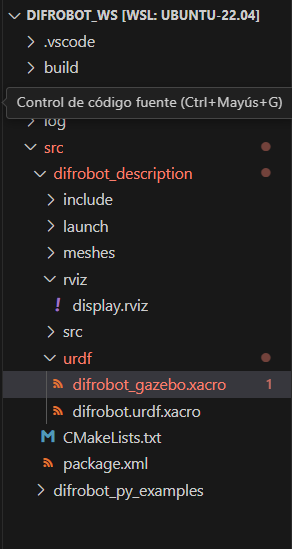
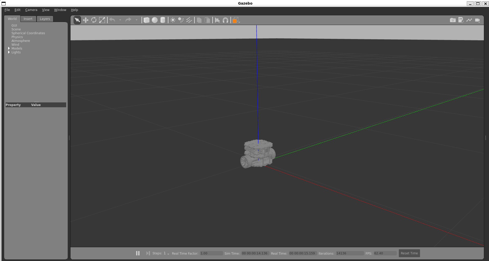

# Clase Robot Gazebo


El objetivo de la presente práctica es conocer los conceptos básico de ROS2 Humble (paquete, nodo, topicos, info y rqt), para la simulación del comportamiento de un robot móvil en Gazebo.

### Compilación del proyecto de clase


<p align="center">
<a href="https://youtu.be/1gEeBYGCAZc" target="_blank">**Enlace a Video Gazebo - Haga clic aquí para más información**</a>
</p>

Clonar repositorio
```bash
git clone --branch Clase-robot-Gazebo --single-branch https://github.com/xXThanatosXx/MobileRobot.git

```
mover archivos a home

```bash
mv ~/MobileRobot/difrobot_ws ~/difrobot_ws
```
Limpiar Cache de CMake
```bash
rm -rf ~/difrobot_ws/build/difrobot_controller
```

compilar
```bash
colcon build
```
Modificar el registro de Gazebo 
```bash
sudo nano /usr/share/gazebo/setup.sh

```
Remplezar las lineas
```bash
export GAZEBO_MASTER_URI=""
export GAZEBO_MODEL_DATABASE_URI=""
```
Modificar el registro de gazebo 11
```bash
sudo nano /usr/share/gazebo-11/setup.sh
```
```bash
export GAZEBO_MASTER_URI=""
export GAZEBO_MODEL_DATABASE_URI=""
```
Copiar carpeta models
```bash
cp -r ~/difrobot_ws/src/difrobot_description/models ~/.gazebo

```
Aplicar cambios

```bash
source /usr/share/gazebo-11/setup.sh

```


### Configuración de urdf para Gazebo

1. Agregar a las articulaciones el componente con los tags: Colision, Inertial  en el archivo difrobot.urdf.xacro:

```xml
<?xml version="1.0"?>

<robot name="difrobot" xmlns:xacro="http://ros.org/wiki/xacro">

  <!-- Include Gazebo Parameters -->
  <xacro:include filename="$(find difrobot_description)/urdf/difrobot_gazebo.xacro" />

  <link name="base_footprint"/>
  
  <link name="base_link">
    <inertial>
      <origin xyz="0 0 0.04" rpy="0.0 0.25 0.3" />
      <mass value="8.2573504e-01"/>
      <inertia ixx="2.2124416e-02" ixy="-1.2294101e-04" ixz="3.4938785e-04"
               iyy="2.1193702e-02" iyz="-5.0120904e-05"
               izz="2.0064271e-02" />
    </inertial>
    <visual>
      <origin xyz="0 0 0" rpy="0 0 0" />
      <geometry>
        <mesh filename="package://difrobot_description/meshes/base_link.STL" />
      </geometry>
    </visual>
    <collision>
      <origin xyz="0 0 0" rpy="0 0 0" />
      <geometry>
        <mesh filename="package://difrobot_description/meshes/base_link.STL" />
      </geometry>
    </collision>
  </link>

  <joint name="base_joint" type="fixed">
    <parent link="base_footprint"/>
    <child link="base_link" />
    <origin xyz="0 0 0.033" rpy="0 0 0"/>
  </joint>

  <link name="wheel_right_link">
    <inertial>
      <origin xyz="0 -0.014 0" rpy="0 0 0" />
      <mass value="0.0530086090966721" />
      <inertia ixx="1.88176298336665E-05" ixy="-4.8444933029987E-10" ixz="1.88163708851143E-08"
               iyy="3.11510738647764E-05" iyz="-6.93560663069607E-11"
               izz="1.8801969558182E-05" />
    </inertial>
    <visual>
      <origin xyz="0 0 0" rpy="1.57 0 0" />
      <geometry>
        <mesh filename="package://difrobot_description/meshes/wheel_right_link.STL" />
      </geometry>
    </visual>
    <collision>
      <origin xyz="0 -0.015 0" rpy="1.57 0 0" />
      <geometry>
        <sphere radius="0.033"/>
      </geometry>
    </collision>
  </link>

  <joint name="wheel_right_joint" type="continuous">
    <origin xyz="0 -0.0701101849418637 0" rpy="0 0 0" />
    <parent link="base_link" />
    <child link="wheel_right_link" />
    <axis xyz="0 1 0" />
  </joint>
  
  <link
    name="wheel_left_link">
    <inertial>
      <origin xyz="0 0.014 0" rpy="0 0 0" />
      <mass value="0.0530086043217644" />
      <inertia ixx="1.8792911368909E-05"  ixy="3.31256392204584E-10" ixz="-1.14082001662767E-08"
               iyy="3.11510738759073E-05" iyz="-3.60499245082192E-10"
               izz="1.88266886146847E-05" />
    </inertial>
    <visual>
      <origin xyz="0 0 0" rpy="-1.57 0 0" />
      <geometry>
        <mesh filename="package://difrobot_description/meshes/wheel_left_link.STL" />
      </geometry>
    </visual>
    <collision>
      <origin xyz="0 0.015 0" rpy="-1.57 0 0" />
      <geometry>
        <sphere radius="0.033"/>
      </geometry>
    </collision>
  </link>

  <joint name="wheel_left_joint" type="continuous">
    <origin xyz="0 0.0701101849418642 0" rpy="0 0 0" />
    <parent link="base_link" />
    <child link="wheel_left_link" />
    <axis xyz="0 1 0" />
  </joint>

  <link name="caster_front_link">
    <inertial>
      <origin xyz="3.89968128948481E-07 2.40073004698083E-07 0.00219173397061506" rpy="0 0 0" />
      <mass value="1.44379265037903E-06" />
      <inertia ixx="7.23075276010246E-11" ixy="-6.10956883467859E-16" ixz="2.22849693525031E-15"
               iyy="3.8713793085917E-11"  iyz="2.93909858781952E-15"
               izz="1.00967486676306E-10" />
    </inertial>
    <visual>
      <origin xyz="0 0 0" rpy="0 0 0" />
      <geometry>
        <mesh filename="package://difrobot_description/meshes/caster_front_link.STL" />
      </geometry>
    </visual>
    <collision>
      <origin xyz="0 0 0" rpy="0 0 0" />
      <geometry>
        <sphere radius="0.005"/>
      </geometry>
    </collision>
  </link>

  <joint name="caster_front_joint" type="fixed">
    <origin xyz="0.04755 0 -0.0275" rpy="0 0 0" />
    <parent link="base_link" />
    <child link="caster_front_link" />
    <axis xyz="0 0 0" />
  </joint>
  
  <link name="caster_rear_link">
    <inertial>
      <origin xyz="3.8996812895542E-07 2.40073004698083E-07 0.00219173397061509" rpy="0 0 0" />
      <mass value="1.44379265037902E-06" />
      <inertia ixx="7.23075276010246E-11" ixy="-6.10956872363424E-16" ixz="2.22849693527207E-15"
               iyy="3.87137930859167E-11" iyz="2.939098587861E-15"
               izz="1.00967486676306E-10" />
    </inertial>
    <visual>
      <origin xyz="0 0 0" rpy="0 0 0" />
      <geometry>
        <mesh filename="package://difrobot_description/meshes/caster_rear_link.STL" />
      </geometry>
    </visual>
    <collision>
      <origin xyz="0 0 0" rpy="0 0 0" />
      <geometry>
        <sphere radius="0.005"/>
      </geometry>
    </collision>
  </link>

  <joint name="caster_rear_joint" type="fixed">
    <origin xyz="-0.04755 0 -0.0275" rpy="0 0 0" />
    <parent link="base_link" />
    <child link="caster_rear_link" />
    <axis xyz="0 0 0" />
  </joint>

</robot>
```

2. Cree un archivo (difrobot_gazebo.xacro) en la carpeta urdf


<p align="center">

</p>

Modifique los siguientes parametros:

- mu1 y mu2: Coeficientes de fricción en las direcciones de contacto primarias y secundarias. Valores extremadamente altos indican alta fricción.
- kp: Coeficiente de rigidez del resorte (spring stiffness) en la simulación.
- kd: Coeficiente de amortiguación (damping).
- minDepth: Profundidad mínima de penetración permitida en la colisión.
- maxVel: Velocidad máxima permitida en la simulación.
- fdir1: Dirección de la fricción primaria, especificada como un vector (1 0 0).

```xml
<?xml version="1.0"?>

<robot name="difrobot" xmlns:xacro="http://ros.org/wiki/xacro">

  <!-- Wheels -->
  <gazebo reference="wheel_left_link">
    <mu1>1000000000000000.0</mu1>
    <mu2>1000000000000000.0</mu2>
    <kp>1000000000000.0</kp>
    <kd>10.0</kd>
    <minDepth>0.001</minDepth>
    <maxVel>0.1</maxVel>
    <fdir1>1 0 0</fdir1>
  </gazebo>
  
  <gazebo reference="wheel_right_link">
    <mu1>1000000000000000.0</mu1>
    <mu2>1000000000000000.0</mu2>
    <kp>1000000000000.0</kp>
    <kd>10.0</kd>
    <minDepth>0.001</minDepth>
    <maxVel>0.1</maxVel>
    <fdir1>1 0 0</fdir1>
  </gazebo>
  
  <!-- Caster Wheels -->
  <gazebo reference="caster_rear_link">
    <mu1>0.1</mu1>
    <mu2>0.1</mu2>
    <kp>1000000.0</kp>
    <kd>100.0</kd>
    <minDepth>0.001</minDepth>
    <maxVel>1.0</maxVel>
  </gazebo>
  
  <gazebo reference="caster_front_link">
    <mu1>0.1</mu1>
    <mu2>0.1</mu2>
    <kp>1000000.0</kp>
    <kd>100.0</kd>
    <minDepth>0.001</minDepth>
    <maxVel>1.0</maxVel>
  </gazebo>

</robot>
```
## Crear Launch File para gazebo

Copie la carpeta models en difrobot_description y cree el archivo gazebo.launch.py 


<p align="center">

</p>


```python
import os
from os import pathsep
from ament_index_python.packages import get_package_share_directory, get_package_prefix

from launch import LaunchDescription
from launch.actions import DeclareLaunchArgument, IncludeLaunchDescription, SetEnvironmentVariable
from launch.substitutions import Command, LaunchConfiguration
from launch.launch_description_sources import PythonLaunchDescriptionSource

from launch_ros.actions import Node
from launch_ros.parameter_descriptions import ParameterValue


def generate_launch_description():
    difrobot_description = get_package_share_directory("difrobot_description")
    difrobot_description_prefix = get_package_prefix("difrobot_description")
    gazebo_ros_dir = get_package_share_directory("gazebo_ros")

    model_arg = DeclareLaunchArgument(name="model", default_value=os.path.join(
                                        difrobot_description, "urdf", "difrobot.urdf.xacro"
                                        ),
                                      description="Absolute path to robot urdf file"
    )

    model_path = os.path.join(difrobot_description, "models")
    model_path += pathsep + os.path.join(difrobot_description_prefix, "share")

    env_var = SetEnvironmentVariable("GAZEBO_MODEL_PATH", model_path)

    robot_description = ParameterValue(Command(["xacro ", LaunchConfiguration("model")]),
                                       value_type=str)

    robot_state_publisher_node = Node(
        package="robot_state_publisher",
        executable="robot_state_publisher",
        parameters=[{"robot_description": robot_description}]
    )

    start_gazebo_server = IncludeLaunchDescription(
        PythonLaunchDescriptionSource(
            os.path.join(gazebo_ros_dir, "launch", "gzserver.launch.py")
        )
    )

    start_gazebo_client = IncludeLaunchDescription(
        PythonLaunchDescriptionSource(
            os.path.join(gazebo_ros_dir, "launch", "gzclient.launch.py")
        )
    )

    spawn_robot = Node(package="gazebo_ros", executable="spawn_entity.py",
                        arguments=["-entity", "difrobot",
                                   "-topic", "robot_description",
                                  ],
                        output="screen"
    )

    return LaunchDescription([
        env_var,
        model_arg,
        start_gazebo_server,
        start_gazebo_client,
        robot_state_publisher_node,
        spawn_robot
    ])

```
display.launch.py
```python
import os
from ament_index_python.packages import get_package_share_directory

from launch import LaunchDescription
from launch.actions import DeclareLaunchArgument
from launch.substitutions import Command, LaunchConfiguration

from launch_ros.actions import Node
from launch_ros.parameter_descriptions import ParameterValue


def generate_launch_description():
    difrobot_description_dir = get_package_share_directory("difrobot_description")

    model_arg = DeclareLaunchArgument(name="model", default_value=os.path.join(
                                        difrobot_description_dir, "urdf", "difrobot.urdf.xacro"
                                        ),
                                      description="Absolute path to robot urdf file")

    robot_description = ParameterValue(Command(["xacro ", LaunchConfiguration("model")]),
                                       value_type=str)

    robot_state_publisher_node = Node(
        package="robot_state_publisher",
        executable="robot_state_publisher",
        parameters=[{"robot_description": robot_description}]
    )

    joint_state_publisher_gui_node = Node(
        package="joint_state_publisher_gui",
        executable="joint_state_publisher_gui"
    )

    rviz_node = Node(
        package="rviz2",
        executable="rviz2",
        name="rviz2",
        output="screen",
        arguments=["-d", os.path.join(difrobot_description_dir, "rviz", "display.rviz")],
    )

    return LaunchDescription([
        model_arg,
        joint_state_publisher_gui_node,
        robot_state_publisher_node,
        rviz_node
    ])
```
Agregar carpeta models en cmake

```c++
cmake_minimum_required(VERSION 3.8)
project(difrobot_description)

if(CMAKE_COMPILER_IS_GNUCXX OR CMAKE_CXX_COMPILER_ID MATCHES "Clang")
  add_compile_options(-Wall -Wextra -Wpedantic)
endif()

# find dependencies
find_package(ament_cmake REQUIRED)


install(
  DIRECTORY meshes urdf models launch rviz
  DESTINATION share/${PROJECT_NAME}

)

if(BUILD_TESTING)
  find_package(ament_lint_auto REQUIRED)
  set(ament_cmake_copyright_FOUND TRUE)
  set(ament_cmake_cpplint_FOUND TRUE)
  ament_lint_auto_find_test_dependencies()
endif()

ament_package()
```

Agregar las dependencias en package.xml

```xml
<?xml version="1.0"?>
<?xml-model href="http://download.ros.org/schema/package_format3.xsd" schematypens="http://www.w3.org/2001/XMLSchema"?>
<package format="3">
  <name>difrobot_description</name>
  <version>0.0.0</version>
  <description>TODO: Package description</description>
  <maintainer email="faustoandresescobar@gmail.com">ros</maintainer>
  <license>TODO: License declaration</license>

  <buildtool_depend>ament_cmake</buildtool_depend>

  <exec_depend>robot_state_publisher</exec_depend>
  <exec_depend>joint_state_publisher_gui</exec_depend>
  <exec_depend>rviz2</exec_depend>
  <exec_depend>ros2launch</exec_depend>


  <test_depend>ament_lint_auto</test_depend>
  <test_depend>ament_lint_common</test_depend>

  <export>
    <build_type>ament_cmake</build_type>
  </export>
</package>

```
Abre una terminal y sigue los siguientes pasos.


compilar el proyecto
```bash
cd difrobot_ws/
```

```bash
colcon build
```
En una nueva terminal :
```bash
. install/setup.bash
```
```bash
ros2 launch difrobot_description gazebo.launch.py
```


<p align="center">

</p>

