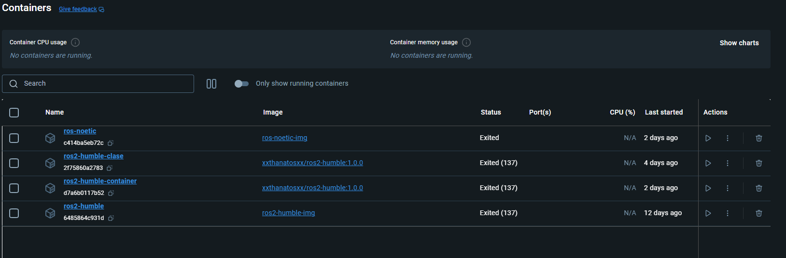
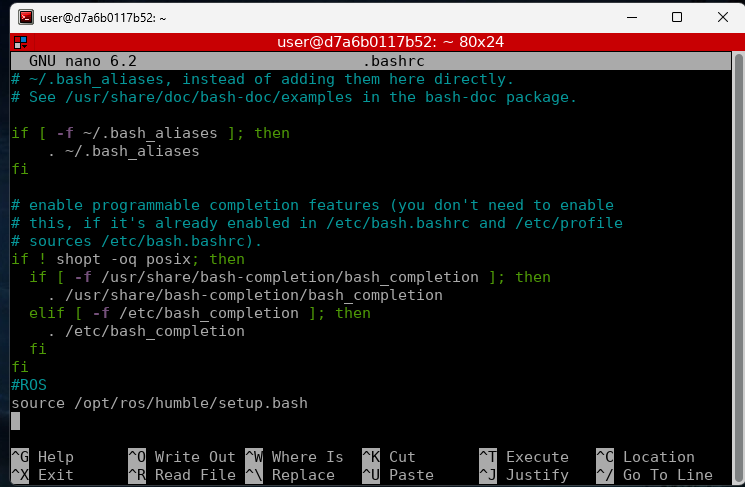

# MobileRobot

Bienvenido al repositorio del curso de Mobile Robot. Este curso está diseñado para estudiantes e investigadores interesados en el campo de la robótica móvil y cubre desde conceptos básicos hasta aplicaciones avanzadas de robótica móvil.

## Estructura del Repositorio

Este repositorio está organizado de la siguiente manera:

- `logos/`: Carpeta que contiene los logos relacionados con el curso.
- `código/`: Ejemplos de código fuente en Python para diferentes módulos del curso.
- `README.md`: Este archivo, que proporciona una visión general y guía sobre el repositorio.

# Instalación de ROS2 Humble
El objetivo de la presente práctica es instalar y configurar el entorno de trabajo de ROS2 Humble en Ubuntu 22.04, empleando una máquina virtual con VMWorkStation Player 17.

## Recursos Adicionales

Para complementar tu aprendizaje en el curso de Mobile Robot, aquí tienes algunos enlaces a recursos externos que podrían ser de tu interés:

Nota: Descargar VMware-player-17.5.2-23775571.exe.tar y descomprimir y ejecutar el archivo .exe

- [VMware-player-17.5.2-23775571.exe.tar](https://softwareupdate.vmware.com/cds/vmw-desktop/player/17.5.2/23775571/windows/core/)
  
- [ubuntu22.4.3](https://releases.ubuntu.com/jammy/ubuntu-22.04.4-desktop-amd64.iso)
- [Documentación Oficial de ROS2 HUMble (Robot Operating System)](https://docs.ros.org/en/humble/index.html)
- 📄 [📂](./Scripts/)Scripts de instalación de ros


### Instalación de Dependencias
Para configurar el entorno necesario para el curso en un sistema operativo Ubuntu, necesitarás instalar algunas dependencias y configurar tu entorno de desarrollo. 
Primero Descargue los archivos de instalación ros2_install.sh y install_ros_packages.sh que se encuentran en la carpeta  [📂](./Scripts/)Scripts y siga los pasos que se indican en el video.


<p align="center">
  <a href="https://youtu.be/sk0WTxr-yic?si=M51wHld4yW2u4Ymt">
    
  </a>
</p>
<p align="center">
<a href="https://www.youtube.com/watch?si=A5CDzYbwtK9ze-UW&v=YznWZz4OKRc&feature=youtu.be" target="_blank">**Enlace a Instalación de Ubuntu - Haga clic aquí para más información**</a>
</p>
<p align="center">
<a href="https://youtu.be/sk0WTxr-yic?si=M51wHld4yW2u4Ymt" target="_blank">**Enlace a Video de instalación Ros2 Humble- Haga clic aquí para más información**</a>.
</p>
<p align="center">
<a href="https://www.youtube.com/watch?v=FrRKkO6UKnQ" target="_blank">**Enlace a Video de instalación VSCode- Haga clic aquí para más información**</a>.
</p>

Abre una terminal y sigue los siguientes pasos.

Presione 
```bash
Crtl + alt + t

```
Cambiar ruta a carpeta Downloads o donde descargó los archvivos de instalación:
```bash
cd Downloads
```
Convertir archivo en ejecutable:
```bash
sudo chmod +x ros2_install.sh
```
Verificar si el archivo es ejecutable:
```bash
ls -la
```
Ejecutar instalador:
```bash
./ros2_install.sh
```
Regresar al directorio principal
```bash
cd
```
Hacer source al bashrc:
```bash
source .bashrc
```
###instalar paquetes adicionales
En nueva terminal ejecutar los siguientes comandos en el espacio de trabajo principal

Presione Crtl + alt + t
```bash
source .bashrc
```
```bash
cd ..
```
```bash
sudo apt-get update 
```
```bash
sudo apt-get install ros-$ROS_DISTRO-joint-state-publisher ros-$ROS_DISTRO-xacro ros-$ROS_DISTRO-joint-state-publisher-gui ros-$ROS_DISTRO-tf2-* ros-$ROS_DISTRO-gazebo-* ros-$ROS_DISTRO-rviz-default-plugins
```
Cambiar a directorio de descargas
```bash
cd Downloads
```
Configurar el archivo install ros packages.sh como ejecutable:
```bash
sudo chmod +x install_ros_packages.sh
```
Verificar configuración
```bash
ls -la
```
Ejecutar el script:
```bash
./install_ros_packages.sh
```
Actualizar el espacio de trabajo en la ruta (home\ros):
```bash
source .bashrc
```
instalar pip en Python:
```bash
sudo apt-get install python3-pip
```
instalar paquete transform 3d:
```bash
pip install transforms3d
```
instalar terminal:
```bash
sudo apt-get install terminator
```
Revisar la versión de Ros instalada:
```bash
rosversion -d
```
# Instalación de ROS2 Humble con Docker
1. [Instalar Docker](https://www.docker.com/)
 
2. [Instalar Xlaunch](https://sourceforge.net/projects/xming/)
 
Docker File:

```python
#change the distro if needed, you can also use a ubuntu image and make your custom ROS install on it.
FROM ros:humble
ARG DEBIAN_FRONTEND=noninteractive

USER root

RUN apt-get update

RUN apt-get install -y build-essential sudo terminator iproute2 gedit lsb-release lsb-core wget nano

RUN adduser user
RUN adduser user sudo
#remove password
RUN passwd -d user

USER user
```

Crear Imagen Ros2 Humble:


Guardar con el nombre (ros2-humble-img):


### Crear el contenedor
```bash
docker run --name ros2-humble --user=user --env=DISPLAY=host.docker.internal:0 --volume="C:\\:/mnt/c" --restart=no --runtime=runc --network=host -t -d ros2-humble-img
```




1. Opcional: crear contenedor con acceso a carpeta
```bash
docker run --name ros2-humble --user=user --env=DISPLAY=host.docker.internal:0 --volume="C:\\:/mnt/c" --volume="C:\\Users\\UNIMAR\\Documents\\Docker\\shared_folder:/mnt/shared_folder" --restart=no --runtime=runc --network=host -t -d ros2-humble-img
```
verificar carpeta
```bash
cd /mnt/shared_folder
```
Copiar carpeta Host to Docker
```bash
docker cp "C:\Users\UNIMAR\Documents\Docker\shared_folder" ros2-humble:/home/user/test
```
Copiar carpeta Docker to Host
```bash
docker cp ros2-humble:/ruta/dentro/del/contenedor "C:\Users\UNIMAR\Documents\Docker\local_folder"

```


### ROS2 Configuración

```bash
source /opt/ros/humble/setup.bash
```
```bash
nano .bashrc
```


Hacer source en bash:
```bash
source /opt/ros/humble/setup.bash
```
```bash
sudo apt-get install ros-humble-rviz2
```

```bash
source ~/.bashrc
```

```bash
rviz2
```
### Descargar imagen Docker
Abrir una terminal cmd y ejecutar los comandos:

Descargar Imagen Docker Ros2 humble
```bash
docker pull xxthanatosxx/ros2-humble:1.0.0

```
Verificar imagen
```bash
docker images

```
Crear contenedor (ros2-humble-container)
```bash
docker run -it --name ros2-humble-container xxthanatosxx/ros2-humble:1.0.0 /bin/bash

```
Iniciar el contenedor
```bash
docker start ros2-humble-container
```
Detener el contenedor
```bash
docker stop ros2-humble-container
```
# Crear imagen Docker a partir de contenedor


```bash
docker ps -a
```
Crear imagen de Contenedor: nombre ros2-humb y el CONTAINER ID 6485864c931d.
```bash
docker commit 6485864c931d xxthanatosxx/ros2-humble:1.0.0
```
Verificar imagen
```bash
docker images

```
Subir imagen a Docker Hub
```bash
docker push xxthanatosxx/ros2-humble:1.0.0

```


# Desinstalación de ROS2 Humble
En una nueva terminal ejecutar:
```bash
sudo apt remove --purge ros-humble-*
```

```bash
sudo apt autoremove
```

```bash
sudo rm /etc/apt/sources.list.d/ros2.list
```
```bash
sudo apt update
```

```bash
nano ~/.bashrc
```
Eliminar las lineas:
```bash
# source ROS 2 environment
source /opt/ros/humble/setup.bash
```
Actualizar bash:
```bash
source ~/.bashrc
```
