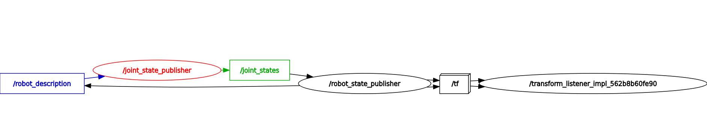
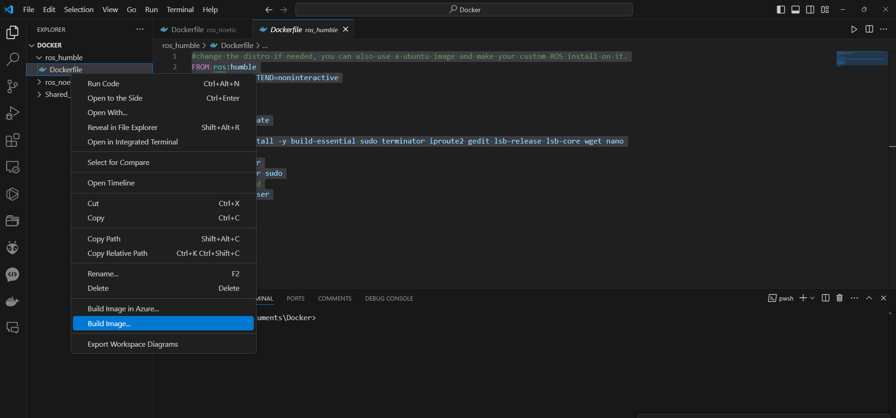
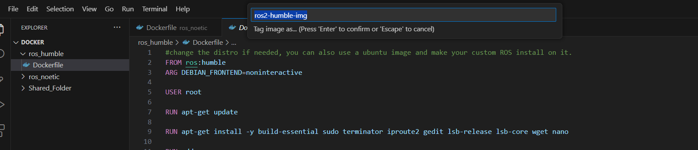

# Clase Robot Gazebo


El objetivo de la presente práctica es conocer los conceptos básico de ROS2 Humble (paquete, nodo, topicos, info y rqt), para la simulación del comportamiento de un robot móvil

### Instalación de paquete Turtlesim


<p align="center">
  <a href="https://youtu.be/sk0WTxr-yic?si=M51wHld4yW2u4Ymt">
    
  </a>
</p>

<p align="center">
<a href="https://youtu.be/sk0WTxr-yic?si=M51wHld4yW2u4Ymt" target="_blank">**Enlace a Video de instalación - Haga clic aquí para más información**</a>.
</p>

Abre una terminal y sigue los siguientes pasos.

Presione 
```bash
Crtl + alt + t

```
Crear un directorio llamado difrobot_ws y un sub directorio src
```bash
mkdir -p difrobot_ws/src
```
Abrir carpeta difrobot_ws:
```bash
cd difrobot_ws/
```
Compilar proyecto
```bash
colcon build
```

revisar si se crearon las carpetas build, install log y src
```bash
ls
```
Cambiar a directorio src
```bash
cd src/
```

Crear paquete difrobot_py_examples
```bash
ros2 pkg create --build-type ament_python difrobot_py_examples
```
Compilar proyecto
```bash
cd ..
```
```bash
colcon build
```

Crear paquete difrobot_description
```bash
cd src/
```
```bash
ros2 pkg create --build-type ament_cmake difrobot_description
```
Compilar proyecto
```bash
cd ..
```
```bash
colcon build
```


En la terminal buscar la ruta difrobot_wsy ejecutar VsCode:
```bash
cd difrobot_ws
```
```bash
code .
```
En Vscode seleccionar la ruta difrobot_ws/src/difrobot_description/ crear las carpetas y el archivo mostrado en  la imagen:
<p align="center">

</p>

En el archivo difrobot.urdf.xacro en Visual Studio code, escriba los siguientes comandos:
```xml
<?xml version="1.0"?>
<robot xmlns:xacro="http://www.ros.org/wiki/xacro" name="difrobot">

    <link name="base_footprint"/>
    
    <link name="base_link">
        <visual>
            <origin xyz="0.0 0.0 0.0" rpy="0.0 0.0 0.0"/>
            
            <geometry>
                <mesh filename="package://difrobot_description/meshes/base_link.STL" />
            </geometry>
        </visual>
    
    </link>

    <joint name="base_joint" type="fixed">
        <parent link="base_footprint"/>
        <child link="base_link"/>
        <origin xyz="0.0 0.0 0.0" rpy="0.0 0.0 0.033"/>
        
    </joint>
</robot>
```
En el archivo CMAKELists agrege el comando con la ruta de archivos meshes y urdf:

```c++
install(
  DIRECTORY meshes urdf
  DESTINATION share/${PROJECT_NAME}

)
```
Compilar el paquete difrobot_description en la ruta difrobot_ws
```bash
cd difrobot_ws
```
```bash
colcon build
```
En una nueva terminal actualizar el bash:
```bash
. install/setup.bash
```
instalar en el proyecto el paquete urdf-tutorial
```bash
sudo apt-get install ros-humble-urdf-tutorial
```
Ejecutar RVIZ con el modelo difrobot.urdf.xacro:
```bash
ros2 launch urdf_tutorial display.launch.py model:=/home/ros/difrobot_ws/src/difrobot_description/urdf/difrobot.urdf.xacro
```

<p align="center">

</p>

## Creación de lanzador (launcher)
El gráfico en RQT muestra la configuración común en ROS2 donde se describe un robot, se publica su estado de las juntas, y se calculan las transformaciones de los enlaces del robot basándose en ese estado, permitiendo así un seguimiento de la posición del robot en el espacio

<p align="center">

</p>


- robot_description: tópico o parámetro que contiene la descripción URDF (Unified Robot Description Format) del robot, que define los modelos de los enlaces y juntas del robot.

- joint_state_publisher: nodo que se suscribe a la descripción del robot y publica el estado de las juntas (es decir, la posición, velocidad y esfuerzo de cada junta) del robot en tiempo real.
- joint_states: tópico donde se publican los estados de las juntas. Este tópico es utilizado por otros nodos para obtener información actualizada sobre las posiciones y movimientos de las juntas del robot.
- robot_state_publisher: nodo se suscribe al tópico /joint_states y utiliza la información sobre los estados de las juntas y la descripción del robot para calcular la cinemática del robot. Luego, publica la información de transformación (es decir, la posición y orientación en el espacio) de cada enlace del robot en el tópico /tf.
- tf: tópico que lleva mensajes para mantener el seguimiento de todas las transformaciones de coordenadas en el tiempo. Esto es crucial para tareas como la navegación y la manipulación, donde es necesario conocer la posición y orientación de diferentes partes del robot en un marco de referencia común.
- transform_listener_impl_562b8b60fe90: un nodo o un componente que escucha las transformaciones publicadas en el tópico /tf. Su nombre sugiere que es una instancia de un oyente de transformadas, lo cual es una parte común de los sistemas que necesitan seguir las transformaciones de coordenadas para el seguimiento o la planificación del movimiento.

### Ejecutar el nodo con Rviz

```bash
. install/setup.bash
```


```bash
ros2 launch urdf_tutorial display.launch.py model:=/home/ros/difrobot_ws/src/difrobot_description/urdf/difrobot.urdf.xacro
```
Crear carpeta (rviz) en la ruta y guardar el archivo con el nombre (display.rviz)
```bash
/home/ros/difrobot_ws/src/difrobot_description/rviz
```




En una nueva terminal buscar la ruta difrobot y abrir vscode
```bash
cd difrobot_ws
```

```bash
. code
```

Crear la carpeta launch y el archivo display.launch.py en la ruta difrobot_description



Contenido del archivo display.launch.py

```python
import os
from ament_index_python.packages import get_package_share_directory

from launch import LaunchDescription
from launch.actions import DeclareLaunchArgument
from launch.substitutions import Command, LaunchConfiguration

from launch_ros.actions import Node
from launch_ros.parameter_descriptions import ParameterValue


def generate_launch_description():
    bumperbot_description_dir = get_package_share_directory("difrobot_description")

    model_arg = DeclareLaunchArgument(name="model", default_value=os.path.join(
                                        bumperbot_description_dir, "urdf", "difrobot.urdf.xacro"
                                        ),
                                      description="Absolute path to robot urdf file")

    robot_description = ParameterValue(Command(["xacro ", LaunchConfiguration("model")]),
                                       value_type=str)

    robot_state_publisher_node = Node(
        package="robot_state_publisher",
        executable="robot_state_publisher",
        parameters=[{"robot_description": robot_description}]
    )

    joint_state_publisher_gui_node = Node(
        package="joint_state_publisher_gui",
        executable="joint_state_publisher_gui"
    )

    rviz_node = Node(
        package="rviz2",
        executable="rviz2",
        name="rviz2",
        output="screen",
        arguments=["-d", os.path.join(bumperbot_description_dir, "rviz", "display.rviz")],
    )

    return LaunchDescription([
        model_arg,
        joint_state_publisher_gui_node,
        robot_state_publisher_node,
        rviz_node
    ])
```

Modificar el archvio CMAKe y agregar la ruta de las carpetas launch y rviz


```c++
cmake_minimum_required(VERSION 3.8)
project(difrobot_description)

if(CMAKE_COMPILER_IS_GNUCXX OR CMAKE_CXX_COMPILER_ID MATCHES "Clang")
  add_compile_options(-Wall -Wextra -Wpedantic)
endif()

# find dependencies
find_package(ament_cmake REQUIRED)


install(
  DIRECTORY meshes urdf launch rviz
  DESTINATION share/${PROJECT_NAME}

)

if(BUILD_TESTING)
  find_package(ament_lint_auto REQUIRED)
  set(ament_cmake_copyright_FOUND TRUE)
  set(ament_cmake_cpplint_FOUND TRUE)
  ament_lint_auto_find_test_dependencies()
endif()

ament_package()
```

Actualizar el archivo package.xml, con las dependencias robot_state_publisher, joint_state_publisher_gui, rviz2, ros2launch

```xml
<?xml version="1.0"?>
<?xml-model href="http://download.ros.org/schema/package_format3.xsd" schematypens="http://www.w3.org/2001/XMLSchema"?>
<package format="3">
  <name>difrobot_description</name>
  <version>0.0.0</version>
  <description>TODO: Package description</description>
  <maintainer email="faustoandresescobar@gmail.com">ros</maintainer>
  <license>TODO: License declaration</license>

  <buildtool_depend>ament_cmake</buildtool_depend>

  <exec_depend>robot_state_publisher</exec_depend>
  <exec_depend>joint_state_publisher_gui</exec_depend>
  <exec_depend>rviz2</exec_depend>
  <exec_depend>ros2launch</exec_depend>


  <test_depend>ament_lint_auto</test_depend>
  <test_depend>ament_lint_common</test_depend>

  <export>
    <build_type>ament_cmake</build_type>
  </export>
</package>
```

En una nueva terminal 
```bash
cd difrobot_ws
```
```bash
colcon build
```
En una nueva terminal 
```bash
. install/setup.bash
```
```bash
ros2 launch difrobot_description display.launch.py
```


## Restablecer ventana RQT
Como volver a la configuración de ventanas en rqt en ros2 humble
```bash
rm -rf ~/.config/ros.org/rqt_gui.ini

```
