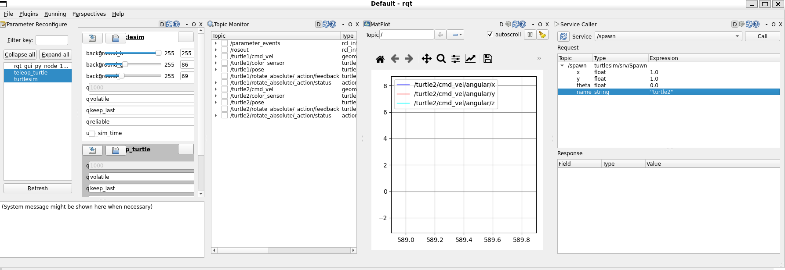

# Clase Turtle Sim


El objetivo de la presente práctica es conocer los conceptos básico de ROS2 Humble (paquete, nodo, topicos, info y rqt), para la simulación del comportamiento de un robot móvil

### Instalación de paquete Turtlesim


<p align="center">
  <a href="https://youtu.be/sk0WTxr-yic?si=M51wHld4yW2u4Ymt">
    
  </a>
</p>

<p align="center">
<a href="https://youtu.be/sk0WTxr-yic?si=M51wHld4yW2u4Ymt" target="_blank">**Enlace a Video de instalación - Haga clic aquí para más información**</a>.
</p>

Abre una terminal y sigue los siguientes pasos.

Presione 
```bash
Crtl + alt + t

```
```bash
sudo apt install ros-humble-turtlesim
```
Revisar si los paquetes están instalados:
```bash
ros2 pkg executables turtlesim
```
En la terminal debe aparecer los siguientes paquetes:

<p align="center">

</p>

## Nodo
Los nodos son las unidades básicas de ejecución en ROS y cada uno se encarga de una tarea específica, como controlar un sensor, realizar cálculos, procesar datos, o controlar actuadores.
  
Ejecutar el simulador Turtlesim en la terminal:
```bash
ros2 run turtlesim turtlesim_node
```
Ejecutar el paquete de Teleoperación en una nueva terminal:
```bash
Presione CRTL + SHIFT + t
```

```bash
ros2 run turtlesim turtle_teleop_key
```
Debe aparaecer un ventana como se muestra a continuación:
<p align="center">

</p>

Emplee las teclas de flechas para desplazar  y las letras (G,B,V,C,D,E,R,T), para orientar la tortuga sobre la terminal de teleoperación.
<p align="center">

</p>

<p align="center">

</p>

Revisar nodos activos en ros es...
```bash
ros2 node list
```
<p align="center">

</p>

## TOPIC
Los topics en ROS proporcionan una manera eficiente y flexible de intercambiar datos entre nodos, lo que facilita la construcción de sistemas robóticos complejos mediante la composición de nodos con funciones específicas.
Revisar tópicos activos
```bash
ros2 topic list
```
<p align="center">

</p>

## Service

Un servicio en ROS (Robot Operating System) es una forma de comunicación entre nodos que se basa en el modelo de petición-respuesta. A diferencia de los topics, que están diseñados para un flujo de datos unidireccional y continuo bajo el paradigma de publicación-suscripción, los servicios permiten una interacción bidireccional y síncrona entre dos nodos. Un nodo ofrece un servicio bajo un nombre específico, mientras que otro nodo puede llamar a este servicio, enviando un mensaje de petición y esperando recibir un mensaje de respuesta.


- `Comunicación síncrona`
- `Bidireccional`
- `Operaciones definidas`

Revisar servicios activos en ROS:
```bash
ros2 service list
```
<p align="center">

</p>

## Action

es un medio de comunicación entre nodos diseñado para ejecutar tareas que toman un tiempo considerable y para las cuales es deseable obtener retroalimentación sobre el progreso de la tarea. A diferencia de los servicios en ROS, que son adecuados para solicitudes síncronas de petición-respuesta que se esperan completar rápidamente, las acciones permiten una interacción más compleja y de larga duración entre nodos.

- `Comunicación Asíncrona`
- `Retroalimentación durante la Ejecución`
- `Cancelación de Tareas`


Revisar acciones activas en ROS:
```bash
ros2 action list
```
<p align="center">

</p>

Ejecutar rqt y abrir plugins (Dynamic Reconfigure, topic monitor, Matplot):
En el servicio de service caller, anexe una nueva tortuga "turtle2" en las cordenadas x,y (1,1)

```bash
rqt
```
<p align="center">

</p>

<p align="center">

</p>


```bash
rqt_graph
```
```bash
ros2 run turtlesim turtle_teleop_key --ros-args --remap turtle1/cmd_vel:=turtle2/cmd_vel
```
```bash
ros2 topic info /turtle2/cmd_vel
```
```bash
ros2 topic echo /turtle2/cmd_vel
```

```bash
ros2 topic list -t
```
```bash
ros2 interface show geometry_msgs/msg/Twist
```
```bash
ros2 topic pub --rate 1 /turtle2/cmd_vel geometry_msgs/msg/Twist "{linear: {x: 2.0, y: 0.0, z: 0.0}, angular: {x: 0.0,  y: 0.0, z: 1.8}}"
```
```bash
ros2 topic type /turtle2/pose
```

```bash
ros2 topic echo /turtle1/pose
```

## Crear Nodo Python para extrar mensajes de posición
- Crear la carpeta difrobot y sub carpeta src, organice los archivos como se muestra en la imagen:

<p align="center">

</p>

```bash
mkdir -p difrobot_ws/src
```
```bash
cd difrobot_ws/
```
```bash
colcon build
```
```bash
cd src/
```
```bash
ros2 pkg create --build-type ament_python difrobot_py_examples
```
```bash
cd ..
```
```bash
colcon build
```
- copiar el archivo simple_turtlesim_kinematics.py en la carpeta difrobot_py_examples
- Modificar el contenido de la los archivos package.xml y setup.py


package.xml
```xml
<?xml version="1.0"?>
<?xml-model href="http://download.ros.org/schema/package_format3.xsd" schematypens="http://www.w3.org/2001/XMLSchema"?>
<package format="3">
  <name>difrobot_py_examples</name>
  <version>0.0.0</version>
  <description>TODO: Package description</description>
  <maintainer email="ros@todo.todo">ros</maintainer>
  <license>TODO: License declaration</license>

  <depend>rclpy</depend>
  <depend>std_msgs</depend>
  <depend>rcl_interfaces</depend>
  <depend>turtlesim</depend>

  <test_depend>ament_copyright</test_depend>
  <test_depend>ament_flake8</test_depend>
  <test_depend>ament_pep257</test_depend>
  <test_depend>python3-pytest</test_depend>

  <export>
    <build_type>ament_python</build_type>
  </export>
</package>
```
setup.py
```python
from setuptools import find_packages, setup

package_name = 'difrobot_py_examples'

setup(
    name=package_name,
    version='0.0.0',
    packages=find_packages(exclude=['test']),
    data_files=[
        ('share/ament_index/resource_index/packages',
            ['resource/' + package_name]),
        ('share/' + package_name, ['package.xml']),
    ],
    install_requires=['setuptools'],
    zip_safe=True,
    maintainer='ros',
    maintainer_email='ros@todo.todo',
    description='TODO: Package description',
    license='TODO: License declaration',
    tests_require=['pytest'],
    entry_points={
        'console_scripts': [
            'simple_turtlesim_kinematics = difrobot_py_examples.simple_turtlesim_kinematics:main',
        ],
    },
)

```

- rclpy: Es la librería de ROS 2 para Python. Proporciona las herramientas necesarias para crear nodos y manejar la comunicación en un sistema ROS 2.
- Node: Clase base para la creación de nodos en ROS 2.
- Pose: Es el tipo de mensaje que define la posición y orientación de un objeto en 2D, utilizado en la simulación turtlesim.
- math: Librería estándar de Python que proporciona funciones matemáticas.

simple_turtlesim_kinematics.py

```python
import rclpy
from rclpy.node import Node
from turtlesim.msg import Pose
import math


class SimpleTurtlesimKinematics(Node):
    
    def __init__(self):
        super().__init__("simple_turtlesim_kinematics")
        self.turtle1_pose_sub_ = self.create_subscription(Pose, "/turtle1/pose", self.turtle1PoseCallback, 10) 
        self.turtle2_pose_sub_ = self.create_subscription(Pose, "/turtle2/pose", self.turtle2PoseCallback, 10)

        self.last_turtle1_pose_ = Pose()
        self.last_turtle2_pose_ = Pose()

    
    def turtle1PoseCallback(self, pose):
        self.last_turtle1_pose_ = pose


    def turtle2PoseCallback(self, pose):
        self.last_turtle2_pose_ = pose
        Tx = self.last_turtle2_pose_.x - self.last_turtle1_pose_.x
        Ty = self.last_turtle2_pose_.y - self.last_turtle1_pose_.y
        theta_rad = self.last_turtle2_pose_.theta - self.last_turtle1_pose_.theta
        theta_deg = 180 * theta_rad / 3.14
        self.get_logger().info("""\n
                      Translation Vector turtle1 -> turtle2\n
                      Tx: %f\n
                      Ty: %f\n
                      Rotation Matrix turtle1 -> turtle2\n 
                      theta (rad): %f\n
                      theta (deg): %f\n
                      |R11   R12|:  |%f %f|\n
                      |R21   R22|   |%f %f|\n""" %
                      (
                        Tx, Ty, theta_rad, theta_deg,
                        math.cos(theta_rad), -math.sin(theta_rad),
                        math.sin(theta_rad), math.cos(theta_rad)
                      )
                    )
        

def main():
    rclpy.init()

    simple_turtlesim_kinematics = SimpleTurtlesimKinematics()
    rclpy.spin(simple_turtlesim_kinematics)
    
    simple_turtlesim_kinematics.destroy_node()
    rclpy.shutdown()


if __name__ == '__main__':
    main()
```
```bash
colcon build 
```

```bash
. install/setup.bash 
```
Crear una tortuga
```bash
ros2 service call /spawn turtlesim/srv/Spawn "x: 2.0
y: 2.0
theta: 0.0
name: 'turtle2'" 
```

Ejecutar el script

```bash
ros2 run difrobot_py_examples simple_turtlesim_kinematics 
```

## Restablecer ventana RQT
Como volver a la configuración de ventanas en rqt en ros2 humble
```bash
rm -rf ~/.config/ros.org/rqt_gui.ini

```
