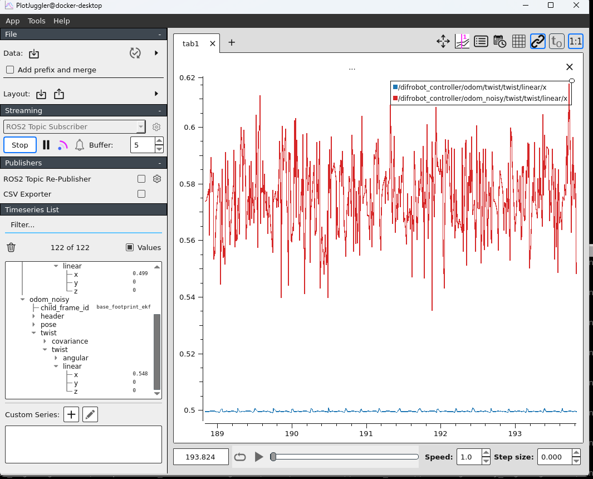

# Ruido en Sensores y Simulación

Ruido en Sensores y Simulación
En entornos reales, los sensores están afectados por ruido, lo que provoca lecturas incorrectas y errores en la estimación de la posición del robot (odometría). Este ruido es causado por fluctuaciones aleatorias debido a factores como la temperatura, interferencias en el sistema de transmisión de señales, y el desgaste de las ruedas. En simulaciones, los encoders suelen ser ideales, sin errores, lo que no refleja el comportamiento real.

El controlador ruidoso introduce ruido gaussiano a las lecturas de los encoders para simular estos escenarios realistas. Esto permite implementar algoritmos más robustos para la localización del robot en entornos reales.

Teorema de la Probabilidad Total
Cuando los eventos son dependientes entre sí, el teorema de la probabilidad total nos permite calcular la probabilidad de un evento A considerando eventos relacionados (B). En el contexto del robot, si no sabemos exactamente dónde está, pero detecta puntos de referencia como árboles o rocas, podemos usar esta información para mejorar la estimación de su posición.

Teorema de Bayes
El Teorema de Bayes es fundamental para actualizar las probabilidades a medida que obtenemos nueva información. En robótica, esto es esencial cuando, por ejemplo, el robot detecta un punto de referencia. Con el teorema de Bayes, podemos reducir la incertidumbre sobre su posición inicial al integrar nuevas observaciones, como un árbol o una roca detectada por los sensores.

$P(A∣B)= P(B)P(B∣A)/P(A)$
​

Donde:

P(A|B): Probabilidad posterior de A dada la evidencia B.
P(A): Probabilidad anterior de A (la estimación inicial).
P(B|A): Verosimilitud, probabilidad de observar B dado que A ocurrió.
P(B): Probabilidad marginal de B, la probabilidad de que ocurra B.
Este teorema se aplicará en la localización del robot para mejorar la precisión utilizando datos de sensores con ruido.


## Ejecutar el Nodo
```bash
ros2 launch difrobot_description gazebo_launch.py
```


```bash
ros2 launch difrobot_controller controller.launch.py use_python:=true

```
```bash
sudo apt-get install ros-humble-plotjuggler*
```
```bash
ros2 run plotjuggler plotjuggler
```
```bash
ros2 run rviz2 rviz2
```

```bash
ros2 topic pub /difrobot_controller/cmd_vel geometry_msgs/msg/TwistStamped "header:
  stamp:
    sec: 0
    nanosec: 0
  frame_id: ''
twist:
  linear:
    x: 0.5
    y: 0.0
    z: 0.0
  angular:
    x: 0.0
    y: 0.0
    z: 0.0" 
```




### Código Python

Clase NoisyController (noisy_controller.py)
La clase NoisyController es el núcleo del nodo y hereda de Node, la clase base para nodos en ROS2.

- Inicializa el nodo, se definen los parámetros del robot como el radio de las ruedas y la separación entre ellas. Estos parámetros se pueden ajustar desde el archivo de configuración en tiempo de ejecución.
```python
def __init__(self):
    super().__init__("noisy_controller")
    self.declare_parameter("wheel_radius", 0.033)
    self.declare_parameter("wheel_separation", 0.17)

```

-  matriz de conversión para el cálculo de la velocidad lineal y angular del robot a partir de las velocidades de las ruedas.

```python
self.speed_conversion_ = np.array([[self.wheel_radius_/2, self.wheel_radius_/2],
                                   [self.wheel_radius_/self.wheel_separation_, -self.wheel_radius_/self.wheel_separation_]])

```

- Mensajes de Odometría y Transformaciones

```python
self.odom_msg_ = Odometry()
self.br_ = TransformBroadcaster(self)
self.transform_stamped_ = TransformStamped()

```

- Método jointCallback:  ejecuta cada vez que se recibe un mensaje de estado de las juntas del robot.

calcula la diferencia en la posición de las ruedas desde la última lectura (dp_left, dp_right) y el tiempo transcurrido (dt). Estos valores se usan para calcular las velocidades de las ruedas

```python
dp_left = wheel_encoder_left - self.left_wheel_prev_pos_
dp_right = wheel_encoder_right - self.right_wheel_prev_pos_
dt = Time.from_msg(msg.header.stamp) - self.prev_time_

```
- Ruido Gauseano: añade ruido gaussiano (media 0, desviación estándar 0.005) a las lecturas de los encoders para simular errores de medición realistas
```python
wheel_encoder_left = msg.position[1] + np.random.normal(0, 0.005)
wheel_encoder_right = msg.position[0] + np.random.normal(0, 0.005)
```

- Cálculo de la Velocidad Lineal y Angular: Usando las velocidades angulares de las ruedas, se calculan la velocidad lineal y angular del robot.

```python
linear = (self.wheel_radius_ * fi_right + self.wheel_radius_ * fi_left) / 2
angular = (self.wheel_radius_ * fi_right - self.wheel_radius_ * fi_left) / self.wheel_separation_

```

- Actualización de Posición: actualiza la posición del robot (x_, y_, theta_) usando las diferencias en la posición de las ruedas.

```python
d_s = (self.wheel_radius_ * dp_right + self.wheel_radius_ * dp_left) / 2
d_theta = (self.wheel_radius_ * dp_right - self.wheel_radius_ * dp_left) / self.wheel_separation_
```

- Publicación de la Odometría

```python
self.odom_pub_.publish(self.odom_msg_)

```

- Publicación de la Transformación: ransformación que relaciona los marcos de referencia odom y base_footprint_noisy, para describir la posición del robot en el espacio.

```python
self.br_.sendTransform(self.transform_stamped_)
```

- Función Principal

```python
def main():
    rclpy.init()
    noisy_controller = NoisyController()
    rclpy.spin(noisy_controller)
    
    noisy_controller.destroy_node()
    rclpy.shutdown()

```


### Archivo CMAKE

```c++
cmake_minimum_required(VERSION 3.8)
project(difrobot_controller)

if(CMAKE_COMPILER_IS_GNUCXX OR CMAKE_CXX_COMPILER_ID MATCHES "Clang")
  add_compile_options(-Wall -Wextra -Wpedantic)
endif()

# find dependencies
find_package(ament_cmake REQUIRED)
find_package(ament_cmake_python REQUIRED)
find_package(rclcpp REQUIRED)
find_package(rclpy REQUIRED)
find_package(geometry_msgs REQUIRED)
find_package(std_msgs REQUIRED)
find_package(sensor_msgs REQUIRED)
find_package(nav_msgs REQUIRED)
find_package(tf2_ros REQUIRED)
find_package(tf2 REQUIRED)

find_package(Eigen3 REQUIRED)

include_directories(include)
include_directories(${EIGEN3_INCLUDE_DIR})

add_executable(simple_controller src/simple_controller.cpp)
ament_target_dependencies(simple_controller rclcpp geometry_msgs std_msgs sensor_msgs nav_msgs tf2_ros tf2 ${Eigen_LIBRARIES})

ament_python_install_package(${PROJECT_NAME})

install(
  DIRECTORY include
  DESTINATION include
)

install(TARGETS
  simple_controller
  DESTINATION lib/${PROJECT_NAME}
)

install(
  DIRECTORY launch config
  DESTINATION share/${PROJECT_NAME}
)

install(PROGRAMS
  ${PROJECT_NAME}/simple_controller.py
  ${PROJECT_NAME}/noisy_controller.py
  DESTINATION lib/${PROJECT_NAME}
)

ament_package()
```
- controller.launch.py

```python
from launch import LaunchDescription
from launch.actions import DeclareLaunchArgument, GroupAction, OpaqueFunction
from launch_ros.actions import Node
from launch.substitutions import LaunchConfiguration
from launch.conditions import UnlessCondition, IfCondition


def noisy_controller(context, *args, **kwargs):
    use_python = LaunchConfiguration("use_python")
    wheel_radius = float(LaunchConfiguration("wheel_radius").perform(context))
    wheel_separation = float(LaunchConfiguration("wheel_separation").perform(context))
    wheel_radius_error = float(LaunchConfiguration("wheel_radius_error").perform(context))
    wheel_separation_error = float(LaunchConfiguration("wheel_separation_error").perform(context))

    noisy_controller_py = Node(
        package="difrobot_controller",
        executable="noisy_controller.py",
        parameters=[
            {"wheel_radius": wheel_radius + wheel_radius_error,
             "wheel_separation": wheel_separation + wheel_separation_error}],
        condition=IfCondition(use_python),
    )


    return [
        noisy_controller_py,
    ]


def generate_launch_description():
    
    use_simple_controller_arg = DeclareLaunchArgument(
        "use_simple_controller",
        default_value="True",
    )

    wheel_radius_error_arg = DeclareLaunchArgument(
        "wheel_radius_error",
        default_value="0.005", #mm
    )
    
    wheel_separation_error_arg = DeclareLaunchArgument(
        "wheel_separation_error",
        default_value="0.02", #cm
    )
    


    use_python_arg = DeclareLaunchArgument(
        "use_python",
        default_value="False",
    )
    wheel_radius_arg = DeclareLaunchArgument(
        "wheel_radius",
        default_value="0.033",
    )
    wheel_separation_arg = DeclareLaunchArgument(
        "wheel_separation",
        default_value="0.17",
    )
    
    use_simple_controller = LaunchConfiguration("use_simple_controller")
    use_python = LaunchConfiguration("use_python")
    wheel_radius = LaunchConfiguration("wheel_radius")
    wheel_separation = LaunchConfiguration("wheel_separation")

    joint_state_broadcaster_spawner = Node(
        package="controller_manager",
        executable="spawner",
        arguments=[
            "joint_state_broadcaster",
            "--controller-manager",
            "/controller_manager",
        ],
    )

    wheel_controller_spawner = Node(
        package="controller_manager",
        executable="spawner",
        arguments=["difrobot_controller", 
                   "--controller-manager", 
                   "/controller_manager"
        ],
        condition=UnlessCondition(use_simple_controller),
    )

    simple_controller = GroupAction(
        condition=IfCondition(use_simple_controller),
        actions=[
            Node(
                package="controller_manager",
                executable="spawner",
                arguments=["simple_velocity_controller", 
                           "--controller-manager", 
                           "/controller_manager"
                ]
            ),
            Node(
                package="difrobot_controller",
                executable="simple_controller.py",
                parameters=[
                    {"wheel_radius": wheel_radius,
                     "wheel_separation": wheel_separation}],
                condition=IfCondition(use_python),
            ),
            Node(
                package="difrobot_controller",
                executable="simple_controller",
                parameters=[
                    {"wheel_radius": wheel_radius,
                     "wheel_separation": wheel_separation}],
                condition=UnlessCondition(use_python),
            ),
        ]
    )

    noisy_controller_launch = OpaqueFunction(function=noisy_controller)

    return LaunchDescription(
        [
             use_simple_controller_arg,
            use_python_arg,
            wheel_radius_arg,
            wheel_separation_arg,
            wheel_radius_error_arg,
            wheel_separation_error_arg,
            joint_state_broadcaster_spawner,
            wheel_controller_spawner,
            simple_controller,
            noisy_controller_launch,
        ]
    )
```