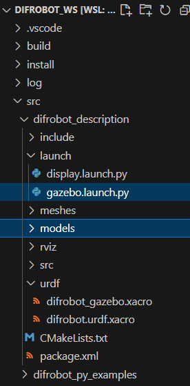

# Clase Robot Gazebo


El objetivo de la presente práctica es conocer los conceptos básico de ROS2 Humble (paquete, nodo, topicos, info y rqt), para la simulación del comportamiento de un robot móvil en Gazebo.

### Configuración de urdf para Gazebo

Agregar a las articulaciones el componente con los tags: Colision, Inertial 

```xml
<?xml version="1.0"?>

<robot name="difrobot" xmlns:xacro="http://ros.org/wiki/xacro">

  <!-- Include Gazebo Parameters -->
  <xacro:include filename="$(find difrobot_description)/urdf/difrobot_gazebo.xacro" />

  <link name="base_footprint"/>
  
  <link name="base_link">
    <inertial>
      <origin xyz="0 0 0.04" rpy="0.0 0.25 0.3" />
      <mass value="8.2573504e-01"/>
      <inertia ixx="2.2124416e-02" ixy="-1.2294101e-04" ixz="3.4938785e-04"
               iyy="2.1193702e-02" iyz="-5.0120904e-05"
               izz="2.0064271e-02" />
    </inertial>
    <visual>
      <origin xyz="0 0 0" rpy="0 0 0" />
      <geometry>
        <mesh filename="package://difrobot_description/meshes/base_link.STL" />
      </geometry>
    </visual>
    <collision>
      <origin xyz="0 0 0" rpy="0 0 0" />
      <geometry>
        <mesh filename="package://difrobot_description/meshes/base_link.STL" />
      </geometry>
    </collision>
  </link>

  <joint name="base_joint" type="fixed">
    <parent link="base_footprint"/>
    <child link="base_link" />
    <origin xyz="0 0 0.033" rpy="0 0 0"/>
  </joint>

  <link name="wheel_right_link">
    <inertial>
      <origin xyz="0 -0.014 0" rpy="0 0 0" />
      <mass value="0.0530086090966721" />
      <inertia ixx="1.88176298336665E-05" ixy="-4.8444933029987E-10" ixz="1.88163708851143E-08"
               iyy="3.11510738647764E-05" iyz="-6.93560663069607E-11"
               izz="1.8801969558182E-05" />
    </inertial>
    <visual>
      <origin xyz="0 0 0" rpy="1.57 0 0" />
      <geometry>
        <mesh filename="package://difrobot_description/meshes/wheel_right_link.STL" />
      </geometry>
    </visual>
    <collision>
      <origin xyz="0 -0.015 0" rpy="1.57 0 0" />
      <geometry>
        <sphere radius="0.033"/>
      </geometry>
    </collision>
  </link>

  <joint name="wheel_right_joint" type="continuous">
    <origin xyz="0 -0.0701101849418637 0" rpy="0 0 0" />
    <parent link="base_link" />
    <child link="wheel_right_link" />
    <axis xyz="0 1 0" />
  </joint>
  
  <link
    name="wheel_left_link">
    <inertial>
      <origin xyz="0 0.014 0" rpy="0 0 0" />
      <mass value="0.0530086043217644" />
      <inertia ixx="1.8792911368909E-05"  ixy="3.31256392204584E-10" ixz="-1.14082001662767E-08"
               iyy="3.11510738759073E-05" iyz="-3.60499245082192E-10"
               izz="1.88266886146847E-05" />
    </inertial>
    <visual>
      <origin xyz="0 0 0" rpy="-1.57 0 0" />
      <geometry>
        <mesh filename="package://difrobot_description/meshes/wheel_left_link.STL" />
      </geometry>
    </visual>
    <collision>
      <origin xyz="0 0.015 0" rpy="-1.57 0 0" />
      <geometry>
        <sphere radius="0.033"/>
      </geometry>
    </collision>
  </link>

  <joint name="wheel_left_joint" type="continuous">
    <origin xyz="0 0.0701101849418642 0" rpy="0 0 0" />
    <parent link="base_link" />
    <child link="wheel_left_link" />
    <axis xyz="0 1 0" />
  </joint>

  <link name="caster_front_link">
    <inertial>
      <origin xyz="3.89968128948481E-07 2.40073004698083E-07 0.00219173397061506" rpy="0 0 0" />
      <mass value="1.44379265037903E-06" />
      <inertia ixx="7.23075276010246E-11" ixy="-6.10956883467859E-16" ixz="2.22849693525031E-15"
               iyy="3.8713793085917E-11"  iyz="2.93909858781952E-15"
               izz="1.00967486676306E-10" />
    </inertial>
    <visual>
      <origin xyz="0 0 0" rpy="0 0 0" />
      <geometry>
        <mesh filename="package://difrobot_description/meshes/caster_front_link.STL" />
      </geometry>
    </visual>
    <collision>
      <origin xyz="0 0 0" rpy="0 0 0" />
      <geometry>
        <sphere radius="0.005"/>
      </geometry>
    </collision>
  </link>

  <joint name="caster_front_joint" type="fixed">
    <origin xyz="0.04755 0 -0.0275" rpy="0 0 0" />
    <parent link="base_link" />
    <child link="caster_front_link" />
    <axis xyz="0 0 0" />
  </joint>
  
  <link name="caster_rear_link">
    <inertial>
      <origin xyz="3.8996812895542E-07 2.40073004698083E-07 0.00219173397061509" rpy="0 0 0" />
      <mass value="1.44379265037902E-06" />
      <inertia ixx="7.23075276010246E-11" ixy="-6.10956872363424E-16" ixz="2.22849693527207E-15"
               iyy="3.87137930859167E-11" iyz="2.939098587861E-15"
               izz="1.00967486676306E-10" />
    </inertial>
    <visual>
      <origin xyz="0 0 0" rpy="0 0 0" />
      <geometry>
        <mesh filename="package://difrobot_description/meshes/caster_rear_link.STL" />
      </geometry>
    </visual>
    <collision>
      <origin xyz="0 0 0" rpy="0 0 0" />
      <geometry>
        <sphere radius="0.005"/>
      </geometry>
    </collision>
  </link>

  <joint name="caster_rear_joint" type="fixed">
    <origin xyz="-0.04755 0 -0.0275" rpy="0 0 0" />
    <parent link="base_link" />
    <child link="caster_rear_link" />
    <axis xyz="0 0 0" />
  </joint>

</robot>
```

Cree un archivo (difrobot_gazebo.xacro) en la carpeta urdf


<p align="center">

</p>

Modifique
```xml
<?xml version="1.0"?>

<robot name="difrobot" xmlns:xacro="http://ros.org/wiki/xacro">

  <!-- Wheels -->
  <gazebo reference="wheel_left_link">
    <mu1>1000000000000000.0</mu1>
    <mu2>1000000000000000.0</mu2>
    <kp>1000000000000.0</kp>
    <kd>10.0</kd>
    <minDepth>0.001</minDepth>
    <maxVel>0.1</maxVel>
    <fdir1>1 0 0</fdir1>
  </gazebo>
  
  <gazebo reference="wheel_right_link">
    <mu1>1000000000000000.0</mu1>
    <mu2>1000000000000000.0</mu2>
    <kp>1000000000000.0</kp>
    <kd>10.0</kd>
    <minDepth>0.001</minDepth>
    <maxVel>0.1</maxVel>
    <fdir1>1 0 0</fdir1>
  </gazebo>
  
  <!-- Caster Wheels -->
  <gazebo reference="caster_rear_link">
    <mu1>0.1</mu1>
    <mu2>0.1</mu2>
    <kp>1000000.0</kp>
    <kd>100.0</kd>
    <minDepth>0.001</minDepth>
    <maxVel>1.0</maxVel>
  </gazebo>
  
  <gazebo reference="caster_front_link">
    <mu1>0.1</mu1>
    <mu2>0.1</mu2>
    <kp>1000000.0</kp>
    <kd>100.0</kd>
    <minDepth>0.001</minDepth>
    <maxVel>1.0</maxVel>
  </gazebo>

</robot>

```
## Crear Launch File para gazebo

Copie la carpeta models en difrobot_description y cree el archivo gazebo.launch.py 

<p align="center">

</p>


Agregar carpeta models en cmake

```c++
cmake_minimum_required(VERSION 3.8)
project(difrobot_description)

if(CMAKE_COMPILER_IS_GNUCXX OR CMAKE_CXX_COMPILER_ID MATCHES "Clang")
  add_compile_options(-Wall -Wextra -Wpedantic)
endif()

# find dependencies
find_package(ament_cmake REQUIRED)


install(
  DIRECTORY meshes urdf models launch rviz
  DESTINATION share/${PROJECT_NAME}

)

if(BUILD_TESTING)
  find_package(ament_lint_auto REQUIRED)
  set(ament_cmake_copyright_FOUND TRUE)
  set(ament_cmake_cpplint_FOUND TRUE)
  ament_lint_auto_find_test_dependencies()
endif()

ament_package()
```
Abre una terminal y sigue los siguientes pasos.


compilar el proyecto
```bash
cd difrobot_ws/
```

```bash
colcon build
```
En una nueva terminal :
```bash
. install/setup.bash
```
```bash
ros2 launch difrobot_description gazebo.launch.py
```

<p align="center">

</p>

